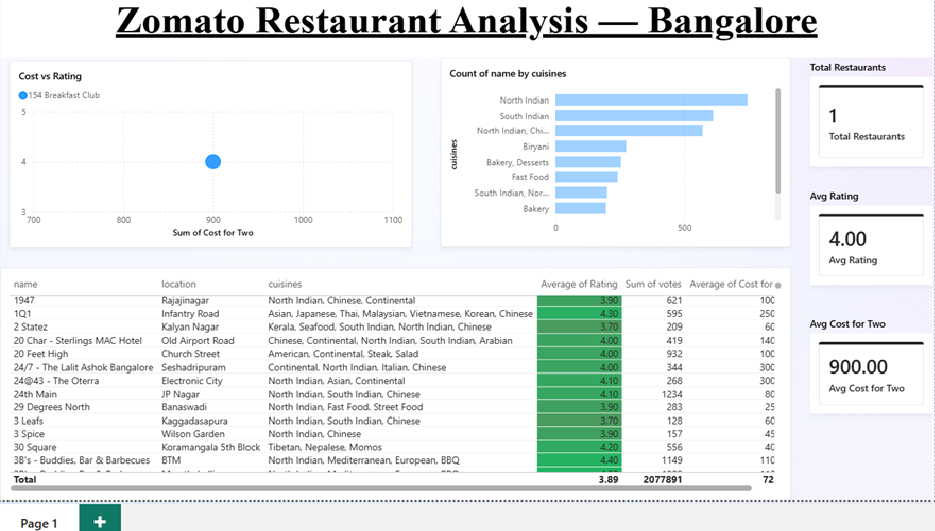

# Zomato Restaurant Analysis | Power BI

An interactive Power BI dashboard analyzing 9,900+ restaurants across Bangalore, built from a raw Zomato dataset. The project covers the full pipeline — data cleaning in Power Query, DAX measures, and a KPI/chart dashboard for restaurant performance analysis.



## 📊 Overview

- **Dataset:** 9,900+ Bangalore restaurants (Zomato)
- **Tools:** Power BI Desktop, Power Query, DAX
- **Avg Rating:** 3.63 / 5
- **Avg Cost for Two:** ₹487

## 🧹 Data Cleaning (Power Query)

The raw dataset required significant cleanup before analysis:

- Split the `rate` column (e.g. `"4.1/5"`) into a clean numeric `Rating` field
- Removed placeholder values (`"NEW"`, `"-"`) and handled resulting nulls without breaking row loads
- Stripped commas from `approx_cost(for two people)` and converted it to a proper numeric `Cost for Two` field
- Renamed unclear columns (`listed_in(city)` → `Area`, `listed_in(type)` → `Meal Type`, etc.)
- Removed duplicate restaurant entries (deduplicated on name + address)
- Dropped unused heavy text columns (`reviews_list`, `menu_item`, `url`, `phone`) to keep the model lean

## 🧮 DAX Measures

```DAX
Total Restaurants = COUNTROWS(zomato)

Avg Rating = AVERAGE(zomato[Rating])

Avg Cost for Two = AVERAGE(zomato[Cost for Two])
```

## 📈 Dashboard Features

**KPI Cards**
Quick-glance totals for restaurant count, average rating, and average cost for two.

**Cost vs Rating (Scatter Plot)**
Bubble chart plotting cost against rating, with bubble size representing vote count — helps visualize whether higher prices correlate with better ratings (spoiler: not really).

**Top 10 Cuisines (Bar Chart)**
Most common cuisine categories across Bangalore restaurants, filtered to the top 10 by restaurant count.

**Top Rated Restaurants (Table)**
Restaurants filtered to 100+ votes (to exclude unreliable low-sample ratings), sorted by rating descending, with red-to-green conditional formatting on the Rating column.


## 🔍 Key Insights

- Average restaurant rating across Bangalore sits at 3.63/5 — genuinely excellent (4.5+) restaurants are a small minority.
- Higher cost does not reliably predict a higher rating — several budget-friendly spots outrate expensive ones.
- North Indian and South Indian cuisines dominate restaurant listings by a wide margin over other cuisine types.
- Restaurants with very high ratings but low vote counts were filtered out of the "Top Rated" table, since a 5.0 rating on 2 votes isn't a meaningful signal.

## 📁 Files

| File | Description |
|---|---|
| `Zomato_Restaurant_Analysis.pbix` | Power BI report file |
| `zomato.csv` | Raw dataset |
| `screenshots/` | Dashboard preview images |

## 🛠 How to Use

1. Download `Zomato_Restaurant_Analysis.pbix`
2. Open in [Power BI Desktop](https://www.microsoft.com/en-us/power-platform/products/power-bi/desktop) (free)
3. Explore the report — use slicers/filters to drill into specific areas, cuisines, or price ranges

## 📌 Data Source

Dataset: [Zomato Bangalore Restaurants](https://www.kaggle.com/datasets) (Kaggle)

---

*Note: This analysis covers Bangalore restaurants specifically, not a global multi-country dataset.*

